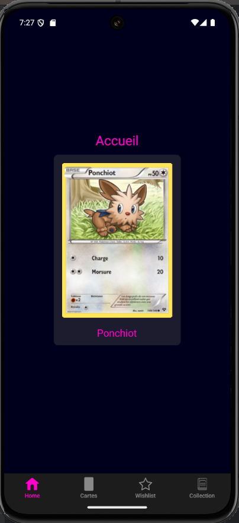
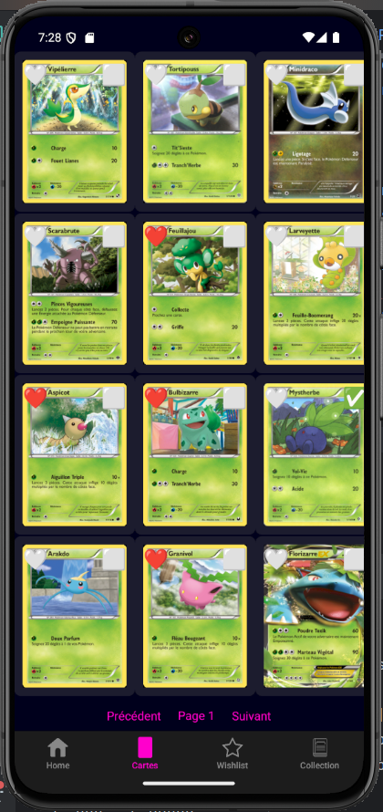
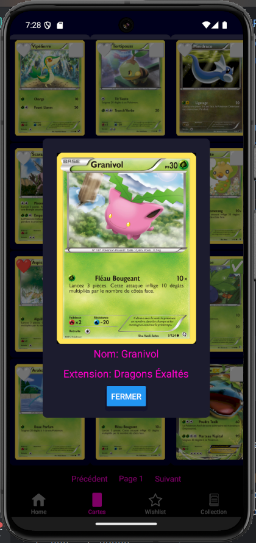
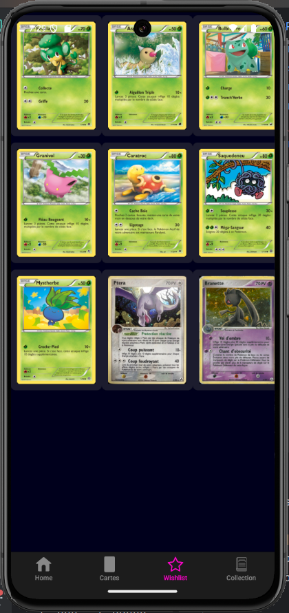
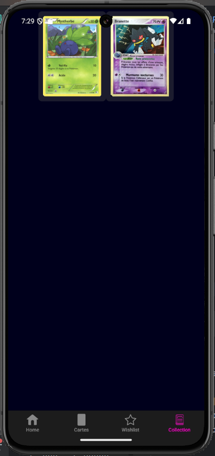

# Pokecard App

Pokecard app est une application regroupant toutes les cartes du TCG Pokémon et permet aux fans de voir les cartes existantes, mais également de les ajouter à leurs favoris ou aux cartes qu'ils possèdent déjà afin de pouvoir faire un suivi de leur collection.

## Technologies utilisées
React JS avec axios pour la gestion de l'API, react-navigation pour la navigation de l'application et la navbar, react bootsplash pour l'affichage d'une animation au démarrage de l'application ainsi que l'async storage pour la gestion des cartes en wishlist et en collection.

## Fonctionnalités principales
- Mise en place d'une navbar reprenant les onglets principaux
- Mise en place d'un onglet `favoris` permettant de gérer et d'avoir une vue sur les cartes que l'on souhaiterait avoir.
- Egalement dans la partie collection, possibilité de voir les cartes que l'on possède déjà
- Une carte présentée aléatoirement sur la page d'accueil pour découvrir de nouvelles cartes
- Détails d'une carte avec l'image agrandie, le nom du pokémon et la série d'où elle vient pour pouvoir la retrouver sur internet.

## API utilisée
https://tcgdex.dev/ en format API REST JSON qui elle n'a pas de limite d'usage et ne nécessite pas de clé d'API par rapport à la première que je souhaitais utiliser qui est https://docs.pokemontcg.io/. Pour les besoins de l'exercice l'adresse par défaut à utiliser est https://api.tcgdex.net/v2. 

## Instruction 

Après avoir ouvert le projet dans notre IDE, on vient créer à la racine un fichier .env dans lequel on rentrera l'URL de l'API utilisée présentée ci-dessus avec le même format que présenté dans le fichier .env.example.
Par la suite, on vient ouvrir un émulateur sur android studio et on le lance, depuis notre IDE on se place sur le projet ou on l'ouvre directement. Quand le chemin est le bon dans le terminal, il suffit de lancer la commande `npx react-native run-android` afin d'installer l'application sur notre simulateur. Une fois qu'elle est installée, si on souhaite la relancer, il suffira de faire un `npx react-native start` toujours depuis le terminal de l'IDE.

## Screenshots 
Ecran d'accueil avec une carte aléatoire

Page de cartes

Page de carte avec détail

Page des cartes voulues/favorites

Page des cartes possédées

